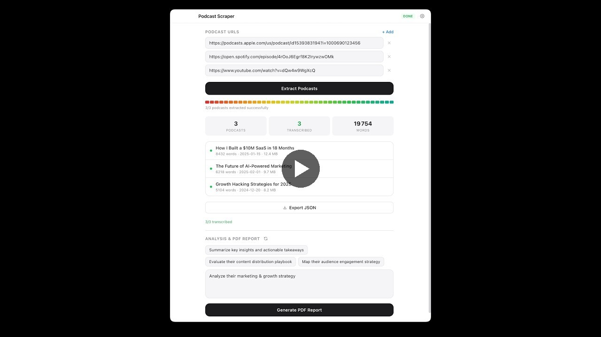
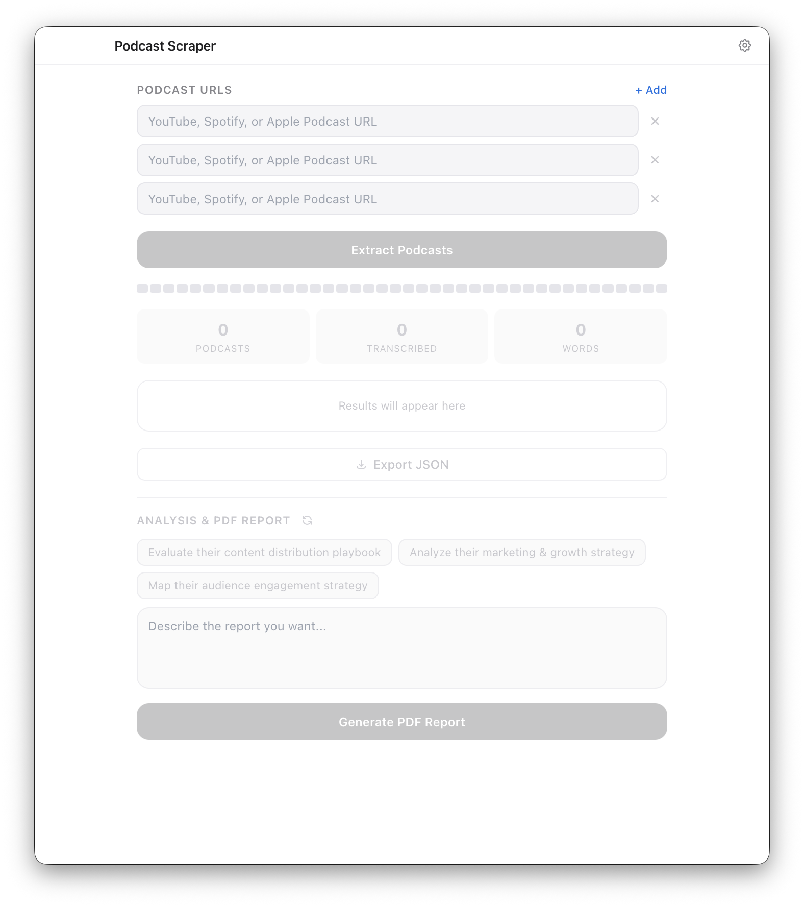
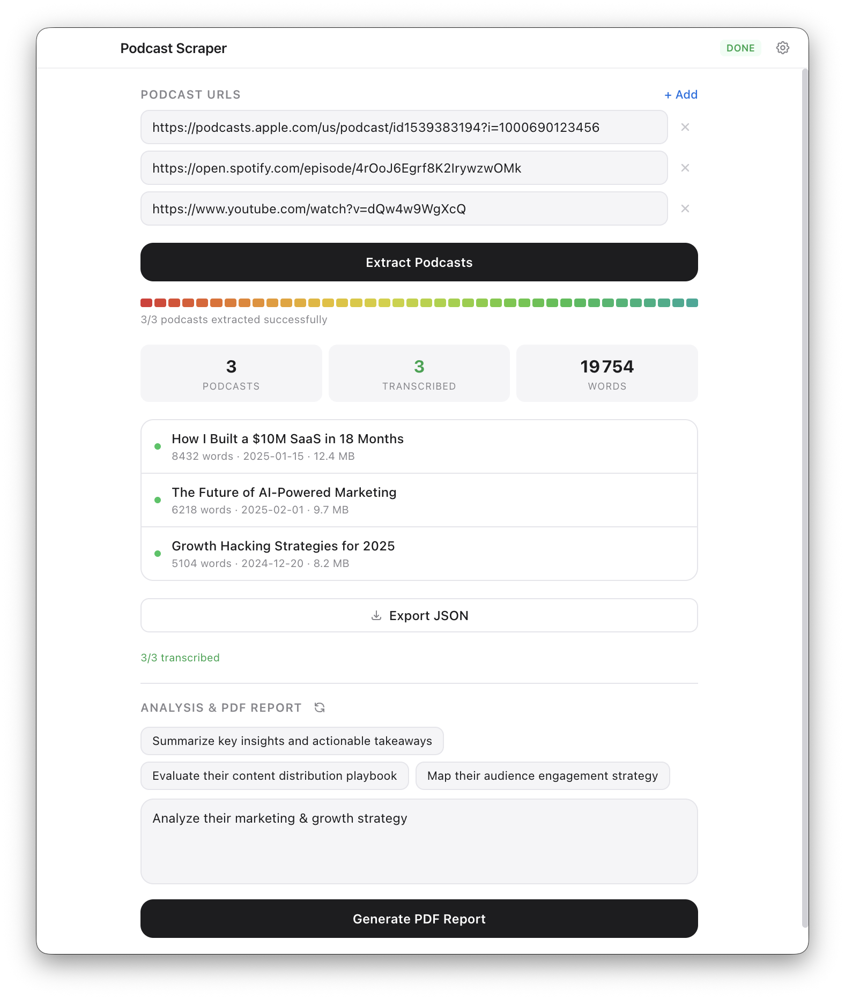
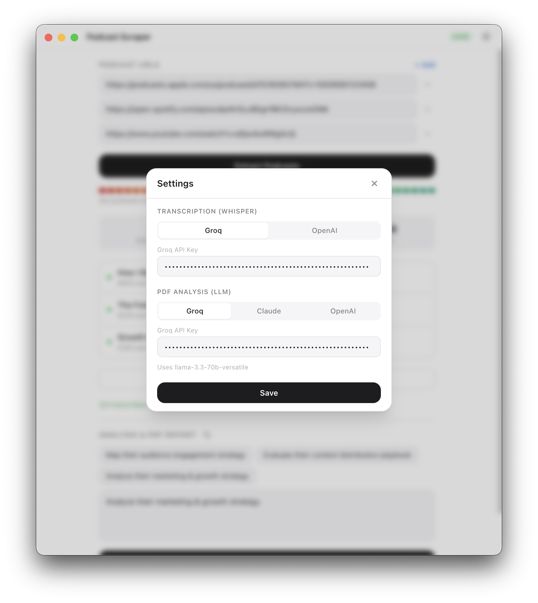

# Podcast Scraper

[](LICENSE)
[](https://www.electronjs.org/)
[](https://reactjs.org/)

Extract, transcribe & analyze podcasts from Apple Podcasts, Spotify & YouTube. Generate AI-powered PDF reports.

## Demo

[](https://www.youtube.com/watch?v=WW9zScPXCec)

## Screenshots

| URL Input | Extraction Results | Settings |
|:-:|:-:|:-:|
|  |  |  |

## Features

- **Multi-platform support**: paste URLs from Apple Podcasts, Spotify, or YouTube
- **Automatic transcription**: audio extracted, converted to MP3, and transcribed via Groq Whisper or OpenAI Whisper
- **AI-powered PDF reports**: generate analysis reports using Claude, GPT-4o-mini, or Llama 3.3
- **Smart audio handling**: automatic file splitting for large podcasts (>24 MB), 64k bitrate optimization
- **JSON export**: structured transcription data with metadata
- **Preset analysis prompts**: quick-start suggestions for marketing, growth, and content analysis
- **Encrypted API key storage**: keys stored locally via electron-store
- **Native macOS look**: clean, Apple-style interface with draggable titlebar

## Prerequisites

- **Node.js** 18+
- **npm**
- **yt-dlp** (required for YouTube and Spotify downloads)

### Install yt-dlp

```bash
# macOS (Homebrew)
brew install yt-dlp

# Linux
sudo apt install yt-dlp    # Debian/Ubuntu
pip install yt-dlp          # or via pip

# Windows
winget install yt-dlp       # or download from https://github.com/yt-dlp/yt-dlp
```

## Quick Start

```bash
git clone https://github.com/florian-create/podcast-scraper.git
cd podcast-scraper
npm install
npm run dev:electron
```

## Usage

1. **Paste podcast URLs**: add one or more URLs from Apple Podcasts, Spotify, or YouTube
2. **Click "Extract Podcasts"**: the app downloads audio, converts to MP3, and transcribes each episode
3. **Review results**: see transcription stats (word count, date, file size) for each podcast
4. **Export JSON** *(optional)*: download structured data with full transcripts
5. **Pick an analysis prompt**: choose a preset suggestion or write your own
6. **Click "Generate PDF Report"**: AI analyzes all transcripts and generates a formatted PDF

## API Keys Setup

Configure API keys in the app via the **Settings** gear icon (top-right).

| Provider | Purpose | Required? | Free tier? | Sign up |
|----------|---------|-----------|------------|---------|
| **Groq** | Transcription (Whisper) + PDF analysis (Llama 3.3) | Recommended | Yes | [console.groq.com](https://console.groq.com/keys) |
| **OpenAI** | Transcription (Whisper-1) + PDF analysis (GPT-4o-mini) | Alternative | No | [platform.openai.com](https://platform.openai.com/api-keys) |
| **Anthropic** | PDF analysis (Claude Sonnet) | Alternative | No | [console.anthropic.com](https://console.anthropic.com/) |

You need **at least one transcription key** (Groq or OpenAI) and **one LLM key** for PDF reports.

## Supported Platforms

| Platform | How it works |
|----------|-------------|
| **Apple Podcasts** | iTunes Lookup API > RSS feed URL > direct audio download from RSS enclosure |
| **Spotify** | oEmbed API > extract episode title > YouTube search fallback via yt-dlp |
| **YouTube** | Direct download via yt-dlp |

## Tech Stack

- **Electron 28**
- **React 18**
- **Tailwind CSS 3**
- **Vite 5**
- **PDFKit**
- **ffmpeg-static**
- **electron-store**
- **@anthropic-ai/sdk** / **openai**

## Build

```bash
# macOS .dmg
npm run build:mac
```

## Contributing

Contributions welcome! Feel free to:

1. Fork the repository
2. Create a feature branch (`git checkout -b feature/my-feature`)
3. Commit your changes
4. Open a Pull Request

Bug reports and feature requests via [Issues](https://github.com/florian-create/podcast-scraper/issues).

## License

[MIT](LICENSE)
